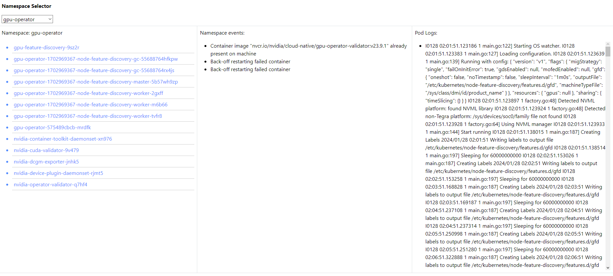

# "KubeAdmin Platform Assistant" - abbreviated as KAPA.

### Features
* Stateless
* Contextual aware using Kubernetes Clientset
* Drop-down to select Kubernetes Namespace. This reveals the pods and the events in the namespace. 
* Clickable pod names displays the pod logs.
* Highly extendable.

### Tech Stack
* [GO](https://go.dev) 
* [GIN](https://gin-gonic.com)
* [HTMX](https://htmx.org)
* [Bootstrap CSS](https://getbootstrap.com)

### Preview
